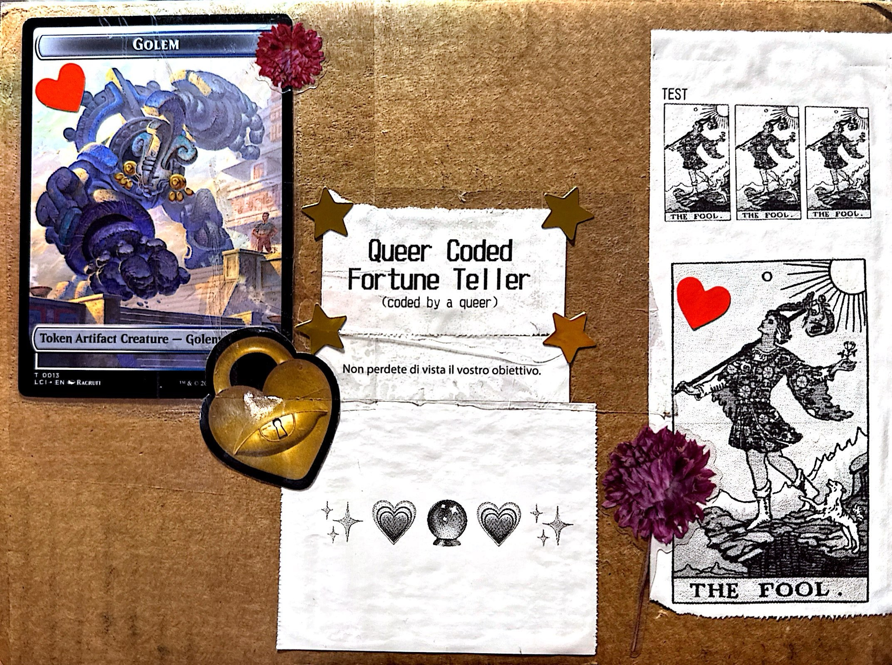

[Home](/) | [Blog](/blog) | [Projects](/projects) | [Resume](/resume)

# Blog

## You can find my dev-logs here.

## [Queer Coded Fortune Teller: Introduction](/blog/QC_intro.md)

Introductory dev-log for the Queer Coded Fortune Teller.

**Concepts:** Python, Raspberry Pi, Thermal Printer, tkinter, fortune teller, GUI

---
